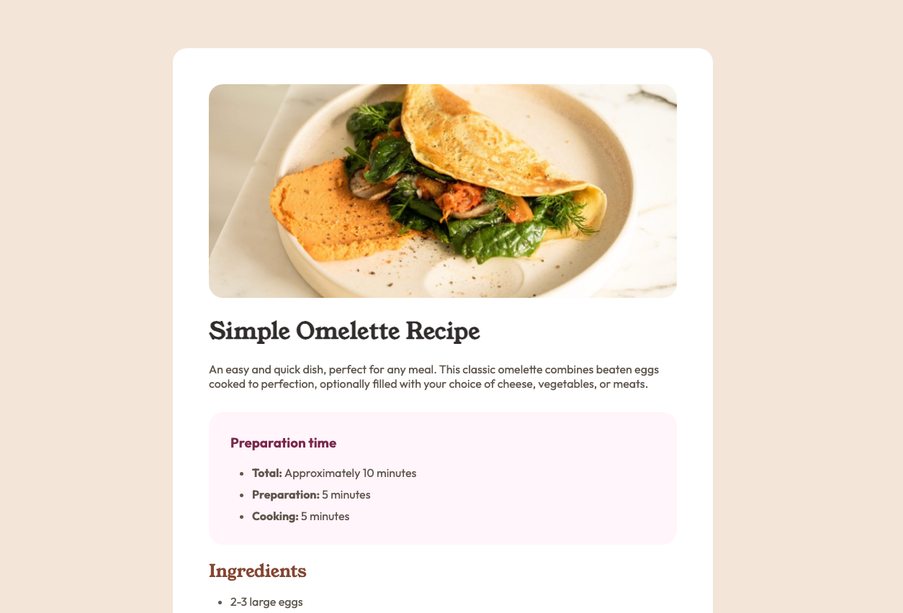

# Frontend Mentor - Recipe page solution

This is a solution to the [Recipe page challenge on Frontend Mentor](https://www.frontendmentor.io/challenges/recipe-page-KiTsR8QQKm). Frontend Mentor challenges help you improve your coding skills by building realistic projects.

## Overview

### Screenshot

### Links

- Solution URL: (https://github.com/nmrtsnh/frontendmentor-projects/tree/main/recipe-page-main)
- Live Site URL: (https://nmrtsnh.github.io/frontendmentor-projects/recipe-page-main/)

## My process

### Built with

- Semantic HTML5 markup
- CSS custom properties
- Flexbox
- Mobile-first workflow
